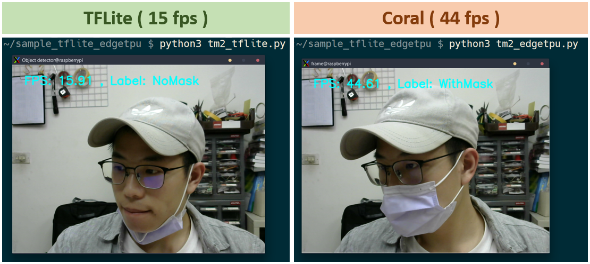

# Rpi4_Coral_TeachableMachine
Run Google Teachable Machine on Raspiberry Pi 4B with Google Coral USB Accelerator

# 介紹
在我們分享的小專案中常常使用到樹莓派來做AI的應用，但是樹莓派終究沒有個人電腦的效能強，所以我們常常需要使用額外的方式來加速它。常見的可能是軟體加速，使用 Tflite、Onnx 等輕量化的模型、結構來減低硬體的負擔，除此之外硬體也需要加速，我們以往最常使用的就是Intel Movidius以及Google Coral USB Accelerator，這兩個產品都是可以透過USB連接埠連接到樹莓派上協助AI加速，而我們今天就是要使用Coral USB Accelerator幫助我們樹莓派運行AI。詳細介紹文章請自[此處](https://www.rs-online.com/designspark/google-coral-usb-acceleratorraspberry-pi4embedded-teachable-machine-cn)

# 程式
執行前請參考文章完成 Teachable Machine 的訓練與模型下載

| 程式  | 描述  |
| ---   | ---   |
| [tm2_tflite.py](./code/tm2_tflite.py)  |  使用 TF Lite 運行 Teachable Machine
| [tm2_edgetpu.py](./code/tm2_edgetpu.py)  |  使用 Google Coral 運行 Teachable Machine
